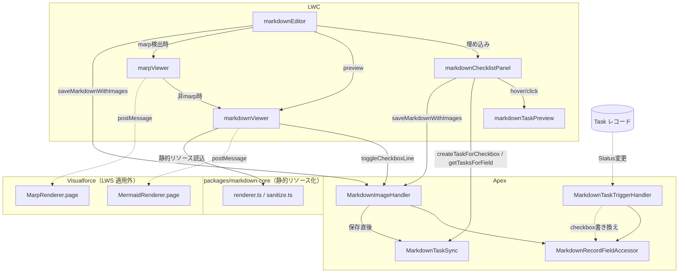
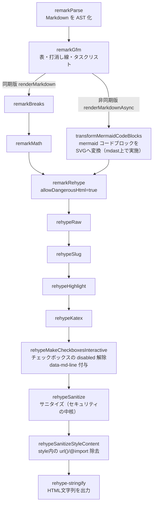

# 設計

[要件定義](requirements.md) を実現するための実装アーキテクチャ。開発手順は [development.md](development.md)、デプロイ手順は [deployment.md](deployment.md)、既知の制約・運用上の注意は [operations.md](operations.md) を参照。

<!-- START doctoc generated TOC please keep comment here to allow auto update -->
<!-- END doctoc generated TOC please keep comment here to allow auto update -->

## コンポーネント全体構成



_図: LWC・Apex・Visualforce・markdown-core の依存関係。実線はコンポーネント間の直接呼び出し、点線は非同期（postMessage・トリガー）連携を示す。_

| レイヤー     | コンポーネント                                       | 役割                                                               |
| ------------ | ---------------------------------------------------- | ------------------------------------------------------------------ |
| LWC          | `markdownEditor`                                     | 編集 UI・保存・チェックリストパネルの埋め込みホスト                |
| LWC          | `markdownViewer`                                     | 表示専用。Record/App/Home/Flow の4ターゲットに対応する共通ビューア |
| LWC          | `marpViewer`                                         | Marp スライド表示（非公開、`markdownEditor` 内部から利用）         |
| LWC          | `markdownChecklistPanel`                             | チェックボックス一覧・Task 作成 UI                                 |
| LWC          | `markdownTaskPreview`                                | Task のホバー/タップ編集ポップオーバー（非公開サブコンポーネント） |
| Apex         | `MarkdownImageHandler`                               | 画像埋め込み保存・チェックボックストグルの唯一の書き込み経路       |
| Apex         | `MarkdownRecordFieldAccessor`                        | 任意オブジェクト・任意項目への動的 FLS/CRUD 保証付き読み書き       |
| Apex         | `MarkdownTaskSync`                                   | チェックリスト UI 用の Task 取得・作成・Markdown→Task 状態同期     |
| Apex         | `MarkdownTaskTriggerHandler` / `MarkdownTaskTrigger` | Task→Markdown 状態同期（after update トリガー）                    |
| VF           | `MarpRenderer.page`                                  | LWS 適用外での Marp + Mermaid 描画                                 |
| VF           | `MermaidRenderer.page`                               | LWS 適用外での単体 Mermaid 図描画（`markdownViewer` から利用）     |
| 静的リソース | `markdownCore`                                       | `packages/markdown-core` のビルド出力（`window.MarkdownCore`）     |
| 静的リソース | `marpCore` / `mermaidJs`                             | Marp Core / Mermaid.js 本体                                        |

## 画像埋め込み保存フロー

保存操作（`markdownEditor` の Save ボタン、チェックボックストグル、チェックリストパネルの Task 作成後の保存）はすべて `MarkdownImageHandler.saveMarkdownWithImages(recordId, objectApiName, fieldApiName, markdownContent)` を経由する。

```mermaid
sequenceDiagram
    participant LWC as markdownEditor
    participant Apex as MarkdownImageHandler
    participant CV as ContentVersion
    participant Accessor as MarkdownRecordFieldAccessor
    participant TaskSync as MarkdownTaskSync

    LWC->>Apex: saveMarkdownWithImages(recordId, objectApiName, fieldApiName, markdown)
    Apex->>Apex: "extractDataUris() で data:image/...;base64,... を走査"
    Apex->>Apex: validateEmbeddedImages()（MIME許可リスト・サイズ上限）
    Apex->>Apex: 画像ごとに computeContentHash()（base64文字列のSHA-256）
    Apex->>CV: Title IN (md-image-<hash>...) で同一レコードの既存CVを検索
    loop 未アップロードの画像のみ（既存CVと一致 / 同一保存内の重複はスキップ）
        Apex->>Apex: checkRuntimeLimits()（CPU時間・ヒープ）
        Apex->>CV: insert as user（Base64デコード→ContentVersion、まとめて1回）
    end
    Apex->>CV: WITH USER_MODE で ContentDocumentId を再取得
    Apex->>Apex: 末尾から前方向に data URI をダウンロードURLへ置換（既存/新規いずれもハッシュ経由で解決）
    Apex->>Accessor: updateRecordField(recordId, fieldApiName, 置換後markdown)
    Accessor->>Accessor: isUpdateable() チェック → update as user
    Apex->>TaskSync: syncCheckboxStatesFromMarkdown(recordId, fieldApiName, 置換後markdown)
    TaskSync->>TaskSync: 全マーカーの状態を抽出し、Task.IsClosedと差分があるものだけ一括update
    Apex-->>LWC: 置換後のmarkdown文字列を返す
```

_図: 画像埋め込み保存とチェックリスト同期の一連の流れ。画像がない場合は ContentVersion 関連の手順をスキップし、フィールド更新とチェックリスト同期のみ行う。_

### 同一画像の重複アップロード防止

各画像の base64 文字列そのもの（デコード後バイト列ではない）に対して SHA-256 ハッシュを計算し、`ContentVersion.Title` に `md-image-<hash>` という形式で埋め込む。保存のたびに `FirstPublishLocationId = recordId AND Title IN (...)` で同一レコードに紐づく既存 `ContentVersion` を検索し、一致するものがあればアップロードをスキップしてその `ContentDocumentId` を再利用する。同一保存内で同じ画像が複数回貼り付けられているケース（例: 同じ画像を2箇所に貼り付け）も、この仕組みで自然に1件のみアップロードされる。

### data URI 抽出・置換アルゴリズム

`extractDataUris` は正規表現の一括マッチではなく、文字列を手動で走査する実装になっている。`data:` → `;base64,` → Base64 文字集合（`[A-Za-z0-9+/=]`）の順に位置を特定し、各マッチの `startIndex`/`endIndex` を元の文字列上のオフセットとして記録する。

置換は **末尾（インデックスの大きい方）から前方向へ** 行う。理由は、先に見つかった（インデックスの小さい）data URI を置換すると、それより後ろにある文字列のオフセットがずれてしまうため。降順に処理すれば、まだ処理していない前方のマッチのオフセットは常に有効なまま残る。

Base64 文字集合の走査自体（`findBase64RunEnd`）は、1文字ずつ `substring` + 文字判定を呼ぶ素朴なループでは実装していない。この org で実測したところ、そのループは約700,000〜900,000文字（実画像で約525〜675KB相当、2MB上限よりずっと小さい）で Apex の CPU 時間ガバナ制限に達して失敗することが判明したため（詳細は [operations.md #6](operations.md#既知の制約・ギャップ一覧)）、200,000文字ずつのチャンクに区切って正規表現 `Matcher.find()` を1回ずつ適用する方式に置き換えている。チャンクサイズは、同じくこの org で確認した「正規表現エンジンが `System.LimitException: Regex too complicated` を投げ始めるサイズ（約1,000,000〜1,500,000文字）」に対して十分な余裕を持たせて選んでいる。

### バリデーションとガバナ制限対策

| 項目                | 値                                                                    |
| ------------------- | --------------------------------------------------------------------- |
| 画像1枚あたりの上限 | 2MB（`MAX_IMAGE_BYTES`）                                              |
| 画像合計の上限      | 6MB（`MAX_TOTAL_IMAGE_BYTES`）                                        |
| 許可 MIME タイプ    | `image/png`, `image/jpeg`, `image/svg+xml`, `image/gif`, `image/webp` |
| CPU時間の閾値       | 10,000ms（`CPU_TIME_THRESHOLD_MS`）                                   |
| ヒープ余裕バッファ  | 256KB（`HEAP_BUFFER_BYTES`）                                          |

画像ごとの処理ループの中で `Limits.getCpuTime()` と `Limits.getHeapSize()`（実際のガバナ上限 `Limits.getLimitHeapSize()` を基準に判定）を都度チェックし、閾値超過時は保存全体を中断してユーザーにエラーを返す。エラーは `MarkdownImageHandlerException` として送出され、`saveMarkdownWithImages`/`toggleCheckboxLine` の catch 節で `friendlyError()` ヘルパー経由の `AuraHandledException` にラップされ、LWC 側で本来のメッセージを表示できる（`friendlyError()` が内部で `setMessage()` を呼ぶ理由は下記コラム参照）。

> **`AuraHandledException` は `getMessage()` に自動でメッセージを反映しない**: `new AuraHandledException(message)` のコンストラクタ引数は、明示的に `.setMessage(message)` を呼ばない限り `getMessage()` には反映されず、常に固定文字列 `"Script-thrown exception"` が返る（Apex/Aura のよく知られた挙動。この org で実機確認済み）。`MarkdownImageHandler.cls`・`MarkdownTaskSync.cls` はこれを踏まえ、`throw new AuraHandledException(...)` を直接書かず、必ず `friendlyError(message)` ヘルパー（内部で `setMessage()` を呼んでから返す）経由で例外を組み立てる（2026-08-25 修正。詳細は [operations.md #13](operations.md#既知の制約・ギャップ一覧)）。
>
> **画像サイズ上限は Apex のヒープ制約に対して楽観的な可能性がある**: 上表の2MB/6MBという上限値は、実際の処理中に元markdown・`DataUriMatch.fullMatch`・`base64Data`・デコード後Blob等、同じデータの複数コピーがヒープ上に同時に存在することを考慮していない。この org での実測では、約1.1MB（150万文字）規模の画像で既にヒープ安全弁が作動して保存を拒否する。安全弁自体は意図通り機能しているが、上限表示の見直しが必要な可能性がある（詳細は [operations.md #6](operations.md#既知の制約・ギャップ一覧)）。

2MB/6MB の境界値超過ケース、CPU/ヒープ閾値超過ケースを実際に駆動するテスト、および上記2件のバグの回帰テストは `MarkdownImageHandlerTest.cls` に追加済み（2026-08-25）。

## チェックリスト⇔Task 双方向同期

### マーカーIDの設計とその限界

チェックボックス行の末尾に `^[todo:xxxxxx]`（`xxxxxx` は6桁の16進数、`markdownChecklistPanel.js` の `randomMarkerId()` がクライアント側で生成）という平文マーカーを付与し、これを Markdown 本文と `Task.MarkdownMarkerId__c` の対応キーとして使う。

- マーカーはあくまで **確率的に衝突しないことを期待した**設計であり、サーバー側で一意性を強制する仕組みはない（`Task.MarkdownMarkerId__c` は `unique=false`）。6桁hex（24bit、約1670万通り）は「同一レコードのチェックリスト内で衝突する確率は実務上無視できる」という判断のコメントが実装に残っている。
- マーカーは Markdown としての構文を持たない単なる末尾テキストなので、remark/rehype パイプラインを素通りする。表示時にのみ `checkbox-transform.ts` が正規表現でマーカーを除去して非表示にする。
- `insertCheckboxMarker` はマーカー挿入時に、人間（または AI）がこのマーカーを誤って削除しないよう、フロントマター内 YAML コメント（フロントマターがある場合）または先頭の HTML コメント（ない場合）として `PRESERVE_MARKER_NOTICE_TEXT` を1回だけ冒頭に挿入する。

### Markdown → Task 方向（保存時の同期）

`MarkdownImageHandler.updateRecordField`（内部ヘルパー）は、フィールド更新の直後に必ず `MarkdownTaskSync.syncCheckboxStatesFromMarkdown(recordId, fieldApiName, value)` を呼び出す。この関数は「保存された本文を単一の正とみなし、変更差分を追跡するのではなく都度状態を突き合わせて同期する」という設計（コード内コメントに明記）。

1. 本文中の全マーカーとチェック状態を `Map<markerId, checked>` として抽出する。
2. `WhatId` + `MarkdownFieldApiName__c` + `MarkdownMarkerId__c IN (...)` で該当する `Task` を検索する。
3. `Task.IsClosed` と Markdown 側の状態が異なる Task だけを対象に、まとめて1回の `update as user` を実行する（差分がなければ DML なし）。

### Task → Markdown 方向（トリガーによる同期）

`MarkdownTaskTrigger`（`after update` のみ）→ `MarkdownTaskTriggerHandler.handleAfterUpdate` が担当する。

1. `MarkdownMarkerId__c` が空でない・`WhatId` がある・`MarkdownFieldApiName__c` が空でない・**かつ `IsClosed` が実際に変化した** Task のみを対象に絞る（Subject 変更など無関係な更新では発火しない）。
2. `WhatId + "::" + MarkdownFieldApiName__c` でグループ化し、同一レコード・同一項目に対する複数 Task の変更を1回の読み書きにまとめる。
3. `MarkdownRecordFieldAccessor.queryFieldValue` で現在の本文を読み、対象マーカーの `[ ]`/`[x]` だけを正規表現で書き換え、変化がなければ DML せずに終了する（無限ループ防止）。書き換えがあれば `updateRecordField` で1回だけ書き込む。
4. 項目が読み取り/更新不可（`FieldAccessException`）の場合は静かに何もしない（トランザクション全体を失敗させない）。

### `Activity` エンティティ経由でのフィールド追加

`Task`/`Event` に直接カスタム項目を追加しようとすると、Metadata API・Tooling API のいずれでも `INVALID_OR_NULL_FOR_RESTRICTED_PICKLIST` エラーになる（一部の利用組織で固有の制約として判明）。回避策として、`Task`/`Event` 共通のフィールドコンテナである `Activity` エンティティ（`force-app/main/default/objects/Activity/fields/`）経由でカスタム項目（`MarkdownMarkerId__c` / `MarkdownFieldApiName__c`）を追加している。Apex コード上は変更なく `Task.MarkdownMarkerId__c` として参照できる。

### バルク処理の考慮

- `MarkdownTaskSync.syncCheckboxStatesFromMarkdown` は1回の呼び出しにつき1レコード・1項目分のみを扱うため、1クエリ・1バルクDMLで完結する。
- `MarkdownTaskTriggerHandler.syncMarkdownForGroup` は「同一 `(WhatId, MarkdownFieldApiName__c)` グループ内の複数 Task」はバルク安全だが、**1トランザクション内で多数の異なる親レコードにまたがる Task の一括更新**（例: 大量の Task を一括で Status 変更）が行われた場合、グループごとに1回の SOQL・DML が発生するため、対象レコードが多数（数百件規模）に及ぶ場合は SOQL/DML のガバナ制限に近づく可能性がある。現状はこの経路のバルク最適化（グループをまとめたクエリ化）は行っていない。

### 既知のエッジケースと非対応事項

| ケース                                                           | 挙動                                                                                                                                                            |
| ---------------------------------------------------------------- | --------------------------------------------------------------------------------------------------------------------------------------------------------------- |
| マーカーに対応する Task が存在しない                             | 「未連携（untodo）」として表示。Create Task で新規作成                                                                                                          |
| マーカーは残っているが Task が削除された                         | 「未連携」として表示され、既存マーカーを再利用して Create Task できる（新規マーカーが重複して振られることはない）                                               |
| Task の `MarkdownMarkerId__c` はあるが対応する本文行が削除された | 「孤立（orphan）」として一覧に表示し続ける                                                                                                                      |
| 同一マーカーIDが複数箇所で偶発的に重複                           | 検出・防止する仕組みはない。Markdown→Task方向は該当する全Taskに同一状態を反映するため実害が出にくいが、Task→Markdown方向は最初に見つかった1箇所のみを書き換える |
| 2方向の同期が同時に走る競合                                      | 明示的なロック（`FOR UPDATE`等）はなし。「既に同じ状態なら書き込みしない」というガードのみで、最終書き込みが勝つ形になる                                        |

## markdown-core（`packages/markdown-core`）の内部設計

TypeScript で実装された Markdown 処理パイプラインで、Vite により `force-app/main/default/staticresources/markdownCore/markdown-core.iife.js` にビルドされ、LWC からは `window.MarkdownCore` として利用する。

### レンダリングパイプライン



_図: Markdown→HTML変換パイプライン。GFM 変換後、同期版（`renderMarkdown`）は `remarkBreaks`/`remarkMath` を経て変換するのに対し、非同期版（`renderMarkdownAsync`、`markdownViewer` が使用）はその代わりに mermaid コードブロックを mdast 上で SVG に変換するステップ（`transformMermaidCodeBlocks`）を挟んでから同じ後段（`remarkRehype` 以降）に合流する。そのため非同期版では `remarkBreaks`/`remarkMath` は適用されない。_

同期版（`renderMarkdown`）は mermaid ブロックを未変換のまま出力する（コードブロックとして表示される）。

### サニタイズ設計（セキュリティの中核）

`sanitize.ts` の `markdownSanitizeSchema` は `hast-util-sanitize` の `defaultSchema` をベースに、以下を明示的に調整している。

- **`foreignObject` を許可タグに含めない**（SVG 経由のスクリプト注入ベクターの遮断）。
- `<style>` タグ自体は許可するが、内容から `url()`・`@import`・`expression()` を正規表現で除去する（`rehypeSanitizeStyleContent`）。
- `<input>` の `required.type = 'checkbox'` のみ許可し、`defaultSchema` が強制する `disabled=true` の付与を無効化（`rehypeMakeCheckboxesInteractive` が外した `disabled` をサニタイザーが復元してしまわないようにするための調整）。
- `clobberPrefix: ''`（`hast-util-sanitize` のデフォルトの id プレフィックス付与を無効化）。Mermaid が生成する内部 CSS セレクタや `url(#id)` 参照が、id 書き換えによって壊れないようにするための調整。
- SVG 要素・属性は専用のホワイトリスト（`SVG_TAGS` / `SVG_ATTRS` / `SVG_DASHED_ATTRS`）で個別に許可する。camelCase（hast 標準）と dash-case（Mermaid が生成する生SVGマークアップ）の両方の属性名バリエーションを許可リストに含める必要がある。

Mermaid の `securityLevel` は必ず `'strict'` を維持し、`htmlLabels: false` とする（LWS 環境下で HTML ラベルの扱いに問題があるため）。この設定を緩めないことは実装上のルールとして明文化されている。

### チェックボックスのインタラクティブ化

`checkbox-transform.ts`（`rehypeMakeCheckboxesInteractive`）は、GFM タスクリストの `<li class="task-list-item">` 内の `<input type=checkbox>` から `disabled` を除去し、`data-md-line`（1-based の元本文行番号）を付与する。この行番号を `markdownViewer.js` がクリックイベントから読み取り、`toggleCheckboxLine` Apex 呼び出しの `line` 引数に使う。同時に `^[todo:xxxx]` マーカーの表示テキストもこのステップで除去する。

### Mermaid 描画の3段構成

1. **VF iframe 経由**（`mermaid-frame-compiler.ts` の `createMermaidFrameCompiler`）: `markdownViewer` の初回接続時に一度だけグローバル登録し、`/apex/MermaidRenderer` を隠しiframeとして生成し `postMessage` で描画を委譲する。LWS の Proxy membrane 配下では `mermaid.render()` の同期DOM処理が大幅に遅くなる（プレビューが「固まる」ように見える）ため、これを回避する目的。
2. **直接描画（フォールバック）**: iframe が利用できない場合、`window.mermaid`（`mermaidJs` 静的リソース）を直接呼び出す。
3. **描画不可時のフォールバック**: どちらも使えない場合は `<div class="mermaid-error">Mermaid runtime not loaded</div>` に置換し、それ以外の Markdown レンダリングは継続する。

SVGは診断ソース文字列をキーにしたLRUキャッシュ（上限50件）で再利用され、同一図が複数回登場する場合は内部 id の重複を避けるため id を書き換えて再利用する（Mermaid は id を内部の `marker`/`clipPath` 参照に埋め込むため、重複するとブラウザが2つ目以降の矢印等を解決できなくなる）。

Marp スライド内の Mermaid 図は、`MarpRenderer.page` 側で同様の理由から複数図を `Promise.all` ではなく順次 `setTimeout(...,0)` を挟んで描画する。

## iframe / postMessage 連携（LWS 回避パターン）

`marpViewer` と `markdownViewer`（Mermaid）は共通のパターンで Visualforce ページへ処理を委譲する。

- **初回コンテンツの受け渡し**（`marpViewer` のみ）: `iframe.name` に markdown 文字列を JSON エンコードして設定し、`iframe.src` を設定する前に済ませておく。これは LWS が `contentWindow` をプロキシすることに起因する不確実性を避けるための工夫（コメントに明記）。
- **以降の再描画・操作**: `window.postMessage` による双方向プロトコル。

| ページ                 | LWC→VF                                                          | VF→LWC                                                                                                 |
| ---------------------- | --------------------------------------------------------------- | ------------------------------------------------------------------------------------------------------ |
| `MarpRenderer.page`    | `RENDER {markdown}` / `PREV` / `NEXT` / `GOTO {slide}` / `PING` | `PAGE_READY` / `PONG` / `READY {slideCount}` / `SLIDE_CHANGED {slide, slideCount}` / `ERROR {message}` |
| `MermaidRenderer.page` | `RENDER_MERMAID {id, definition}`                               | `PAGE_READY` / `MERMAID_RESULT {id, svg}` / `MERMAID_ERROR {id, message}`                              |

両ページとも `postMessage(data, "*")`（ワイルドカードオリジン）で送信する。org・サンドボックス・My Domain 設定によって Visualforce のドメイン文字列が変わるため、`targetOrigin` を具体的な文字列に固定することは避けている。一方、受信側では `event.origin` の文字列検証ではなく **`event.source`（送信元ウィンドウの参照）を、実際にマウントした iframe の `contentWindow` または `window.parent` と突き合わせる**方式で送信元を検証している（2026-08-25 対応。`marpViewer.js`・`mermaid-frame-compiler.ts` は自身がマウントした iframe と比較し、`MarpRenderer.page`・`MermaidRenderer.page` は `window.parent` と比較する）。この方式は org ごとに異なるドメインパターンを知らなくても、ページ上の別ウィンドウ・別フレームからの偽装メッセージを排除できる。

初回読み込みと `PAGE_READY` イベントが同時に発火しうるため、両ページとも「初回送信済みフラグ」「レンダリング中フラグ」による二重描画防止のガードを持つ（二重描画は Mermaid の固定id同士が競合し、フリーズしたように見える不具合の原因になっていたため、明示的に対処している）。

## クライアント側の設計上の工夫（LWS 対応）

- **CSS ベースの疑似フルスクリーン**: LWS が `Element.requestFullscreen()` をブロックするため、`markdownEditor`・`marpViewer` はいずれも `position:fixed; inset:0` の CSS クラス切り替えでフルスクリーン相当の見た目を実現している。
- **`lwc:dom="manual"`**: `markdownViewer` はサニタイズ済み HTML を `Range.createContextualFragment` で直接 DOM に注入する。LWC の再レンダリングループとの競合を避けるため、対象コンテナを手動DOM管理にしている。
- **markdown-core のグローバル公開**: Vite ビルド時にカスタムプラグイン（`lwsGlobalExport`）で `window.MarkdownCore = MarkdownCore;` を明示的に追記している。LWS 配下では IIFE トップレベルの `var` 代入が実際の `window` に届かず、コンポーネントのプロキシ内のローカル変数になってしまうため。

## 既知の制約・ギャップ

実装調査・修正の過程で判明した既知の制約・ギャップは、二重管理を避けるため [operations.md の「既知の制約・ギャップ一覧」](operations.md#既知の制約・ギャップ一覧) に一元化している。対応状況（未対応／対応済み）も含めて随時更新されるため、最新情報はそちらを参照。
