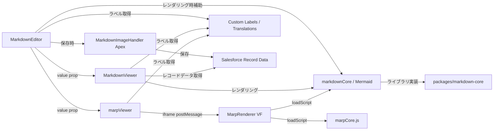

# Markdown コンポーネント実装ドキュメント

このドキュメントは `sf-markdown-editor` リポジトリの現在の実装内容を整理し、`MarkdownEditor` / `MarkdownViewer` のアーキテクチャ、保存フロー、ラベル・翻訳・権限、テスト戦略をわかりやすく記載します。

## 1. 目的

- Salesforce 上で Markdown を編集・保存できる `MarkdownEditor`
- 保存済み Markdown をレンダリング・表示する `MarkdownViewer`
- Base64 埋め込み画像を Salesforce Content に変換して保存する Apex ロジック
- 多言語対応のカスタムラベルによる UI 文言管理
- 実装に沿った LWC / Apex テストケースの整理

## 2. リポジトリ構成

- `force-app/main/default/lwc/markdownEditor`
  - `markdownEditor.html`
  - `markdownEditor.js`
  - `markdownEditor.css`
  - `markdownEditor.js-meta.xml`
  - `__tests__/markdownEditor.test.js`
- `force-app/main/default/lwc/markdownViewer`
  - `markdownViewer.html`
  - `markdownViewer.js`
  - `markdownViewer.css`
  - `markdownViewer.js-meta.xml`
  - `__tests__/markdownViewer.test.js`
- `force-app/main/default/lwc/marpViewer` ← **追加**
  - `marpViewer.html`
  - `marpViewer.js`
  - `marpViewer.css`
  - `marpViewer.js-meta.xml`
- `force-app/main/default/pages` ← **追加**
  - `MarpRenderer.page`
  - `MarpRenderer.page-meta.xml`
- `force-app/main/default/classes`
  - `MarkdownImageHandler.cls`
  - `MarkdownImageHandlerTest.cls`
- `force-app/main/default/labels`
  - `CustomLabels.labels-meta.xml`
- `force-app/main/default/translations`
  - `en_US.translation-meta.xml` ← ファイル形式変更（旧 `en_US.translation`）
  - `ja.translation-meta.xml` ← ファイル形式変更（旧 `ja.translation`）
- `force-app/main/default/customPermissions`
  - `MarkdownEditorViewerAccess.customPermission-meta.xml`
- `force-app/main/default/permissionsets`
  - `MarkdownEditorViewer.permissionset-meta.xml`
- `force-app/main/default/staticresources`
  - `markdownCore.resource-meta.xml`
  - `markdownCore/markdown-core.iife.js`
  - `mermaidJs.resource-meta.xml`
  - `mermaidJs.js`
  - `marpCore.js` ← **追加**（Marp Core IIFE バンドル）
  - `marpCore.resource-meta.xml` ← **追加**
- `manifest/package.xml`
- `packages/markdown-core`
  - Markdown 解析 / レンダリング / サニタイズの共通ロジック
- `packages/marp-core` ← **追加**
  - Marp Core IIFE バンドルのビルド設定

## 3. 静的リソースの作成

### 3.1 markdownCore の作成

`markdownCore` は `packages/markdown-core` のビルド成果物です。Salesforce LWC では `@salesforce/resourceUrl/markdownCore` で参照し、`loadScript()` で `markdown-core.iife.js` を読み込みます。

手順:

1. `cd packages/markdown-core`
2. `npm install`
3. `npm run build`

このビルドでは `vite.config.ts` の設定により、出力ファイルが
`force-app/main/default/staticresources/markdownCore/markdown-core.iife.js`
に生成されます。

`markdownCore` は LWS (Lightning Web Security) で実行されるため、`vite.config.ts` のカスタムプラグインがビルド出力に
`window.MarkdownCore = MarkdownCore;`
を追加して、コンポーネントから `window.MarkdownCore.renderAndSanitizeAsync()` を呼べるようにしています。

### 3.1.1 ライブラリバージョン

`packages/markdown-core/package.json` の現在の依存バージョンは次のとおりです。

| 区分                | ライブラリ           | バージョン |
| ------------------- | -------------------- | ---------- |
| Markdown パース基盤 | `unified`            | `^11.0.5`  |
| remark              | `remark-parse`       | `^11.0.0`  |
| remark              | `remark-gfm`         | `^4.0.0`   |
| remark              | `remark-breaks`      | `^4.0.0`   |
| remark              | `remark-math`        | `^6.0.0`   |
| remark              | `remark-rehype`      | `^11.1.1`  |
| rehype              | `rehype-raw`         | `^7.0.0`   |
| rehype              | `rehype-slug`        | `^6.0.0`   |
| rehype              | `rehype-highlight`   | `^7.0.2`   |
| rehype              | `rehype-katex`       | `^7.0.1`   |
| rehype              | `rehype-sanitize`    | `^6.0.0`   |
| rehype              | `rehype-stringify`   | `^10.0.0`  |
| sanitize 補助       | `hast-util-sanitize` | `^5.0.2`   |
| Mermaid             | `mermaid`            | `^11.14.0` |
| Build               | `vite`               | `^5.3.4`   |
| Test                | `vitest`             | `^1.6.0`   |
| Test DOM            | `jsdom`              | `^24.1.3`  |
| TypeScript          | `typescript`         | `^5.4.5`   |

### 3.2 marpCore の作成

`marpCore` は `packages/marp-core` のビルド成果物です。Visualforce ページ `MarpRenderer` が `$Resource.marpCore` として参照します。

**LWS (Lightning Web Security) の制約:** `marpCore.js`（3.6MB IIFE）を LWC から `loadScript()` で読み込もうとすると Summer '26 LWS がブロックします。そのため VF ページ（`MarpRenderer`）を iframe として埋め込み、LWS サンドボックス外でロードする設計を採用しています（詳細は「5. marpViewer」参照）。

手順:

1. `cd packages/marp-core`
2. `npm install`
3. `npm run build`

出力先: `force-app/main/default/staticresources/marpCore.js`

**fs スタブの必要性:** `@marp-team/marp-core` は Node.js の `fs` モジュールをインポート時に参照します。`vite-plugin-node-polyfills` は `fs` を `null` で返すため `existsSync` のデストラクチャリング時にクラッシュします。`packages/marp-core/src/fs-stub.ts` を `vite.config.ts` の `resolve.alias` で差し替えることで解決しています。

```typescript
// vite.config.ts
resolve: {
  alias: {
    fs: path.resolve(__dirname, "src/fs-stub.ts");
  }
}
```

### 3.3 mermaidJs の作成

`mermaidJs` は Mermaid の配布版 JavaScript を静的リソースとして配置します。現在のリポジトリでは `mermaidJs.js` として管理され、次の場所に置きます:

- `force-app/main/default/staticresources/mermaidJs.js`

`markdownViewer` は `@salesforce/resourceUrl/mermaidJs` から `mermaidJs.js` を読み込み、Markdown 内の Mermaid 図をレンダリングするために利用します。

### 3.3.1 Mermaid バージョン

`packages/markdown-core/package.json` では Mermaid の依存バージョンが `^11.14.0` です。`mermaidJs.js` 側はこのバージョンを前提にしたバンドルとなっており、Mermaid の更新時には静的リソースの差し替えと動作検証が必要です。

### 3.4 デプロイ時の注意点

- `markdownCore` と `mermaidJs` の両方を `force-app/main/default/staticresources` に配置する
- `markdownCore.resource-meta.xml` / `mermaidJs.resource-meta.xml` が同じフォルダにあることを確認する
- `sfdx force:source:deploy -p force-app/main/default/staticresources` または `manifest/package.xml` を使ってデプロイする

## 4. アーキテクチャ概要

`MarkdownEditor` と `MarkdownViewer` は LWC UI 層を担い、`markdown-core` および `mermaidJs` の静的リソースを通じて Markdown レンダリングを行います。Apex `MarkdownImageHandler` は Base64 埋め込み画像の保存と Markdown 置換を担当します。



## 5. MarkdownEditor

### 5.1 目的

`MarkdownEditor` はレコードページ上で Markdown を入力・編集し、指定した `fieldApiName` の長文欄へ保存します。

### 5.2 主な特徴

- Markdown 編集用ツールバー
- 編集 / プレビューのタブ切り替え
- `defaultMode` による初期表示制御
- Base64 埋め込み画像の検出・保存
- 更新不可フィールドでは編集不可 / プレビュー自動遷移
- `textarea` には `maxlength` を設定しない

### 5.3 公開 API

- `@api recordId`
- `@api objectApiName`
- `@api fieldApiName`
- `@api defaultMode`
- `@api value`

### 5.4 保存フロー

1. `@wire(getObjectInfo)` でフィールドアクセス可否と `length` を取得
2. `@wire(getRecord)` で Markdown をロード
3. 編集時に `isDirty` を設定
4. 保存時に `MarkdownImageHandler.saveMarkdownWithImages` を呼び出す
5. 保存後に `getRecordNotifyChange()` を実行

### 5.5 画像保存処理

- Markdown から `data:image/...;base64,` 形式の data URI を抽出
- 各画像を `ContentVersion` として登録
- `FirstPublishLocationId` にレコード ID を設定
- `ContentDocumentId` を基にダウンロード URL へ置換
- MIME タイプ / 1 画像サイズ / 総サイズ / Salesforce ランタイム制限を検証

### 5.6 marpViewer との統合

プレビューペインに `c-marp-viewer` を追加し、Marp フロントマターが検出された場合は `c-markdown-viewer` を非表示にします。フロントマターの検出は `markdownEditor.js` の `hasMarp` ゲッターで行います（doctoc TOC コメントを除去してから判定）。

### 5.7 文言管理

`MarkdownEditor` は多くの UI 文言をカスタムラベルで管理します。

## 6. marpViewer / MarpRenderer

### 6.1 目的

`marpViewer` は Marp フロントマター（`marp: true`）を含む Markdown をスライドとしてレンダリングします。LWS (Lightning Web Security) の制約により `marpCore.js` を LWC から直接読み込めないため、Visualforce ページ `MarpRenderer` を iframe として埋め込む方式を採用しています。

### 6.2 アーキテクチャ（LWS 制約への対応）

Summer '26 以降、LWS は 3MB を超える IIFE バンドルの `loadScript()` をブロックします。回避策として VF ページ（LWS サンドボックス外）でスクリプトをロードし、LWC との通信は `postMessage` API で行います。

```
markdownEditor
  └── marpViewer (LWC / LWS 内)
        └── <iframe src="/apex/MarpRenderer"> (VF / LWS 外)
              ├── marpCore.js    ← @marp-team/marp-core IIFE
              └── mermaidJs.js   ← Mermaid レンダリング
```

**通信プロトコル:**

| 方向     | メッセージタイプ         | 内容                                    |
| -------- | ------------------------ | --------------------------------------- |
| LWC → VF | `RENDER`                 | Markdown 文字列送信（iframe.onload 後） |
| LWC → VF | `PREV` / `NEXT` / `GOTO` | スライド操作                            |
| VF → LWC | `PAGE_READY`             | VF ページロード完了通知                 |
| VF → LWC | `READY`                  | Marp レンダリング完了・スライド枚数通知 |
| VF → LWC | `SLIDE_CHANGED`          | 現在のスライド番号通知                  |

### 6.3 marpViewer 公開 API

- `@api value` — Markdown 文字列

### 6.4 Marp 検出ロジック

```javascript
// フロントマターの marp: true を検出（doctoc TOC コメントを事前除去）
_detectMarp(markdown) {
  const stripped = markdown.replace(/^(<!--[\s\S]*?-->\s*)+/, "");
  const match = /^---\r?\n([\s\S]*?)\r?\n---/.exec(stripped);
  return match ? /^\s*marp\s*:\s*true\s*$/m.test(match[1]) : false;
}
```

### 6.5 MarpRenderer の Mermaid 対応

Marp は Mermaid コードブロックを `<code class="language-mermaid">` として出力します（未レンダリング）。`renderMarkdown` 内で以下の後処理を行います：

1. `code.language-mermaid` → `div.mermaid` に置換（`textContent` で HTML エンティティをデコード）
2. `mermaid.render()` を各 div に対して個別呼び出し（`mermaid.run()` は非同期タイミング問題あり）
3. 全 Mermaid レンダリング完了後に `showSlide(0)` を呼び出す（hidden 要素へのレンダリング回避）

### 6.6 スライド切り替えの実装詳細

Marp は各スライドを `svg[data-marpit-svg]` でラップして出力します。`section` への CSS 適用は foreignObject 内では効かないため、`svg` 要素の `display` を `style.setProperty(..., 'important')` で直接制御します。

```javascript
function showSlide(index) {
  container.querySelectorAll("svg[data-marpit-svg]").forEach((svg, i) => {
    svg.style.setProperty(
      "display",
      i === index ? "block" : "none",
      "important"
    );
  });
}
```

### 6.7 カスタムラベル（marpViewer）

| ラベル名              | en_US          | ja               |
| --------------------- | -------------- | ---------------- |
| `MarpPrevSlide`       | Previous slide | 前のスライド     |
| `MarpNextSlide`       | Next slide     | 次のスライド     |
| `MarpToggleSlideView` | Slide view     | スライド表示     |
| `MarpToggleDocView`   | Document view  | ドキュメント表示 |

## 7. MarkdownViewer

### 6.1 目的

`MarkdownViewer` は保存済み Markdown を安全にレンダリングして表示します。

### 6.2 主な特徴

- `markdown-core` による Markdown → HTML 変換
- Mermaid ランタイムのオプション読み込み
- DOM 直接描画によるサニタイズ済み HTML 表示
- `value` プロパティを直接受け入れ、レコード API より優先表示
- `value` が空文字でも動作

### 6.3 公開 API

- `@api recordId`
- `@api objectApiName`
- `@api fieldApiName`
- `@api value`

### 6.4 レンダリングフロー

1. `markdownValue` を設定
2. `scheduleRender()` で 80ms デバウンス
3. `window.MarkdownCore.renderAndSanitizeAsync(markdown)` を実行
4. 安全な HTML を DOM に挿入
5. ページ内リンクを補正

### 6.5 カスタムラベル

- `MarkdownPreviewAriaLabel`
- `MarkdownLoadingAltText`
- `MarkdownViewerErrorText`

## 8. Apex 画像保存ロジック

### 7.1 目的

`MarkdownImageHandler` は embedded Base64 画像を Salesforce の Content に保存し、Markdown をダウンロード URL に置換します。

### 6.2 実装

- `MarkdownImageHandler.cls`
- `MarkdownImageHandlerTest.cls`

### 6.3 現在のチェック内容

- サポート画像 MIME タイプは `image/png`, `image/jpeg`, `image/svg+xml`, `image/gif`, `image/webp`
- Base64 文字列の妥当性チェック
- 1 画像あたり 2MB まで、合計 6MB まで
- Salesforce の CPU / heap 制限に近い場合は早期エラー

### 6.4 保存フロー

1. `extractDataUris()` で data URI を抽出
2. `validateEmbeddedImages()` で MIME / Base64 / サイズを検証
3. `ContentVersion` を作成して挿入
4. 保存済み `ContentVersion` から `ContentDocumentId` を取得
5. Markdown 内の data URI をダウンロード URL に置換
6. 更新済み Markdown を指定フィールドに保存

### 6.5 エラーハンドリング

- 無効な MIME タイプは AuraHandledException
- 無効な Base64 データは AuraHandledException
- 画像サイズ超過は AuraHandledException
- 更新不可フィールドは AuraHandledException
- `recordId` / `fieldApiName` の未指定も AuraHandledException

## 9. メタデータと権限

- `manifest/package.xml` に Apex クラス、LWC、静的リソース、カスタムラベル、翻訳、パーミッションセット、カスタムパーミッションを含む
- `MarkdownEditorViewerAccess` カスタムパーミッション
- `MarkdownEditorViewer` パーミッションセット

## 10. テスト

- `force-app/main/default/lwc/markdownEditor/__tests__/markdownEditor.test.js`
- `force-app/main/default/lwc/markdownViewer/__tests__/markdownViewer.test.js`
- `packages/markdown-core/__tests__/` のテスト
- `force-app/main/default/classes/MarkdownImageHandlerTest.cls`

### 実行コマンド

```bash
npm test
```

### 追加ドキュメント

- `docs/markdown-component-tests.md`

## 11. ライセンス

- このリポジトリは `MIT` ライセンスのもとで公開されています。
- `packages/markdown-core` の主要依存ライブラリはすべて `MIT` です。
- `markdownCore` / `mermaidJs` の静的リソースは `MIT` ベースのライブラリを含む形で再配布可能です。

## 12. 開発 / デプロイ

### 依存関係インストール

```bash
npm install
```

### Salesforce へのデプロイ

```bash
sf project deploy start \
  --source-dir force-app/main/default/lwc \
  --source-dir force-app/main/default/pages \
  --source-dir force-app/main/default/labels \
  --source-dir force-app/main/default/translations \
  --source-dir force-app/main/default/classes \
  --source-dir force-app/main/default/customPermissions \
  --source-dir force-app/main/default/permissionsets \
  --source-dir force-app/main/default/staticresources \
  --target-org <alias> --wait 30
```

静的リソース `marpCore.js` は 3.6MB のため初回デプロイに時間がかかる場合があります。`marpCore` は `packages/marp-core` のビルド成果物であり、デプロイ前に `npm run build` を実行する必要があります。

## 13. 注意点

- `MarkdownEditor` の `textarea` には `maxlength` を指定していません。
- `MarkdownViewer` は Mermaid 読み込み失敗時も Markdown レンダリングを継続します。
