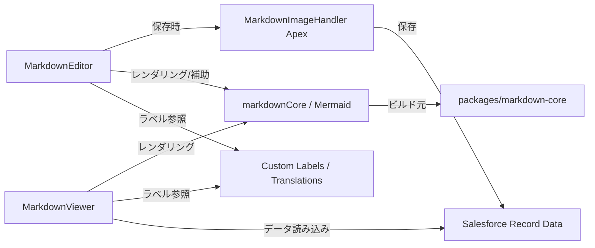

# Markdown コンポーネント実装ドキュメント

このドキュメントは `sf-markdown-editor` リポジトリの現在の実装内容を整理し、`MarkdownEditor` / `MarkdownViewer` のアーキテクチャ、保存フロー、ラベル・翻訳・権限、テスト戦略をわかりやすく記載します。

## 1. 目的

- Salesforce 上で Markdown を編集・保存できる `MarkdownEditor`
- 保存済み Markdown をレンダリング・表示する `MarkdownViewer`
- Base64 埋め込み画像を Salesforce Content に変換して保存する Apex ロジック
- 多言語対応のカスタムラベルによる UI 文言管理
- LWC テストケースを明示した開発ドキュメント

## 2. リポジトリ構成

- `force-app/main/default/lwc/markdownEditor`
  - `markdownEditor.html`
  - `markdownEditor.js`
  - `markdownEditor.css`
  - `markdownEditor.js-meta.xml`
  - `__tests__/markdownEditor.test.js`
- `force-app/main/default/lwc/markdownViewer`
  - `markdownViewer.html`
  - `markdownViewer.js`
  - `markdownViewer.css`
  - `markdownViewer.js-meta.xml`
  - `__tests__/markdownViewer.test.js`
- `force-app/main/default/classes`
  - `MarkdownImageHandler.cls`
  - `MarkdownImageHandlerTest.cls`
- `force-app/main/default/labels`
  - `CustomLabels.labels-meta.xml`
- `force-app/main/default/translations`
  - `en_US.translation`
  - `ja.translation`
- `force-app/main/default/customPermissions`
  - `MarkdownEditorViewerAccess.customPermission-meta.xml`
- `force-app/main/default/permissionsets`
  - `MarkdownEditorViewer.permissionset-meta.xml`
- `manifest/package.xml`
- `packages/markdown-core`
  - Markdown 解析 / レンダリング / サニタイズの共通ロジック

## 3. アーキテクチャ概要

`MarkdownEditor` と `MarkdownViewer` は LWC UI 層を担い、静的リソース `markdownCore` と `mermaidJs` を経由して Markdown レンダリングを行います。Apex `MarkdownImageHandler` は Base64 埋め込み画像の保存と Markdown 置換を担当します。



## 4. MarkdownEditor

### 4.1 目的

`MarkdownEditor` はレコードページ上で Markdown を編集し、`fieldApiName` で指定した長文エリア項目に保存します。

### 4.2 主な特徴

- Markdown 編集ツールバー
- 編集 / プレビューのタブ切り替え
- `defaultMode` による初期表示制御
- Base64 埋め込み画像の検出・Salesforce への保存
- 編集権限がない場合はプレビューへフォールバック
- `textarea` に `maxlength` は設定していない

### 4.3 API

- `@api recordId`
- `@api objectApiName`
- `@api fieldApiName`
- `@api defaultMode`
- `@api value`

### 4.4 保存フロー

1. `@wire(getObjectInfo)` でフィールドのアクセス可否と長さ情報を取得
2. `@wire(getRecord)` で Markdown をロード
3. 編集時に `isDirty` フラグを設定
4. 保存時に `MarkdownImageHandler.saveMarkdownWithImages` を呼び出し
5. 保存成功後 `getRecordNotifyChange()` を実行

### 4.5 画像保存処理

- Markdown から data URI を抽出
- 各画像を `ContentVersion` に登録
- `FirstPublishLocationId` にレコード ID を設定し、Salesforce 側で `ContentDocument` / `ContentDocumentLink` を生成
- `ContentDocumentId` に変換した URL で Markdown を置換
- 画像種別・サイズ・総容量・ランタイム制限を検証

### 4.6 ラベル

`MarkdownEditor` は多くの UI 文言をカスタムラベルから取得します。例:

- `MarkdownToolbarAriaLabel`
- `MarkdownBoldTitle` / `MarkdownBoldLabel`
- `MarkdownItalicTitle` / `MarkdownItalicLabel`
- `MarkdownHeadingTitle` / `MarkdownHeadingLabel`
- `MarkdownCodeTitle` / `MarkdownCodeLabel`
- `MarkdownUnorderedListTitle` / `MarkdownUnorderedListLabel`
- `MarkdownOrderedListTitle` / `MarkdownOrderedListLabel`
- `MarkdownLinkTitle` / `MarkdownLinkLabel`
- `MarkdownTableTitle` / `MarkdownTableLabel`
- `MarkdownStrikethroughTitle` / `MarkdownStrikethroughLabel`
- `MarkdownBlockquoteTitle` / `MarkdownBlockquoteLabel`
- `MarkdownImageTitle` / `MarkdownImageLabel`
- `MarkdownHorizontalRuleTitle` / `MarkdownHorizontalRuleLabel`
- `MarkdownEditTabLabel` / `MarkdownPreviewTabLabel`
- `MarkdownSaveLabel` / `MarkdownSavedLabel`
- `MarkdownEditorPlaceholder`
- `MarkdownEditorAriaLabel`
- `MarkdownTabsAriaLabel`
- `MarkdownCharacterCountSuffix`
- `MarkdownUnsavedBadge`
- `MarkdownBoldPlaceholder`
- `MarkdownItalicPlaceholder`
- `MarkdownHeadingPlaceholder`
- `MarkdownListPlaceholder`
- `MarkdownLinkPlaceholder`
- `MarkdownTableTemplate`
- `MarkdownTableCellPlaceholder`
- `MarkdownTextPlaceholder`
- `MarkdownBlockquotePlaceholder`
- `MarkdownImageDescriptionPlaceholder`
- `MarkdownSaveSuccessMessage`
- `MarkdownSaveErrorMessage`

## 5. MarkdownViewer

### 5.1 目的

`MarkdownViewer` は保存済み Markdown をサニタイズして表示します。

### 5.2 主な特徴

- `markdown-core` によるレンダリング
- Mermaid ランタイム読み込み
- `lwc:dom="manual"` による HTML 直接描画
- エラー状態 / 読み込み中表示

### 5.3 API

- `@api recordId`
- `@api objectApiName`
- `@api fieldApiName`
- `@api value`

`value` が設定されている場合は、レコード取得より優先されます。

### 5.4 レンダリングフロー

1. Markdown を `markdownValue` に設定
2. `scheduleRender()` で 80ms デバウンス
3. `window.MarkdownCore.renderAndSanitizeAsync()` を呼び出し
4. 生成 HTML を DOM に挿入
5. ページ内リンクを補正

### 5.5 カスタムラベル

- `MarkdownPreviewAriaLabel`
- `MarkdownLoadingAltText`
- `MarkdownViewerErrorText`

## 6. Apex 画像保存ロジック

### 6.1 目的

`MarkdownImageHandler` は Base64 埋め込み画像を Salesforce の Content に保存し、Markdown の data URI をダウンロード URL に置換します。

### 6.2 実装内容

- `MarkdownImageHandler.cls`
- `MarkdownImageHandlerTest.cls`

### 6.3 テストカバレッジ

`MarkdownImageHandlerTest.cls` では以下を検証しています。

- 画像なし Markdown の保存
- Base64 埋め込み画像の変換と `ContentVersion` / `ContentDocumentLink` の生成
- JPEG / PNG / SVG の mime 型処理
- サポート外 MIME タイプのエラー
- `recordId` / `fieldApiName` の入力値チェック
- `objectApiName` 無指定時の保存
- `markdownContent` が `null` の場合の空文字保存
- 更新不可能フィールドのエラー

### 6.4 エラーハンドリング

- サポート外 MIME タイプは例外を返す
- 画像単体サイズ / 総サイズ制限を超えた場合は例外を返す
- Salesforce の CPU / heap 制限に近い場合は例外を返す
- 無効項目 / レコード ID に対しては明示的に例外を返す

## 7. メタデータと権限

- `manifest/package.xml` に Apex クラス、LWC、静的リソース、カスタムラベル、翻訳、パーミッションセット、カスタムパーミッションを含む
- `MarkdownEditorViewerAccess` カスタムパーミッション
- `MarkdownEditorViewer` パーミッションセット
  - `MarkdownImageHandler` Apex クラスへのアクセスを含む

## 8. テスト

- `force-app/main/default/lwc/markdownEditor/__tests__/markdownEditor.test.js`
- `force-app/main/default/lwc/markdownViewer/__tests__/markdownViewer.test.js`

### 実行コマンド

```bash
npm test
```

### 追加ドキュメント

- `docs/markdown-component-tests.md`

## 9. 開発 / デプロイ

### 依存関係インストール

```bash
npm install
```

### Salesforce へのデプロイ

```bash
sfdx force:source:deploy -p force-app/main/default/lwc/markdownEditor,force-app/main/default/lwc/markdownViewer,force-app/main/default/labels,force-app/main/default/translations,force-app/main/default/classes,force-app/main/default/customPermissions,force-app/main/default/permissionsets
```

## 10. 注意点

- `MarkdownEditor` の `textarea` は `maxlength` を設定していません。Base64 埋め込み画像を含む Markdown を扱うため、保存時の制限でエラーを補足します。
- `MarkdownViewer` は `markdown-core` のロードと Mermaid のロードを別経路で扱い、レンダリング時に安全なフォールバックをサポートします。
